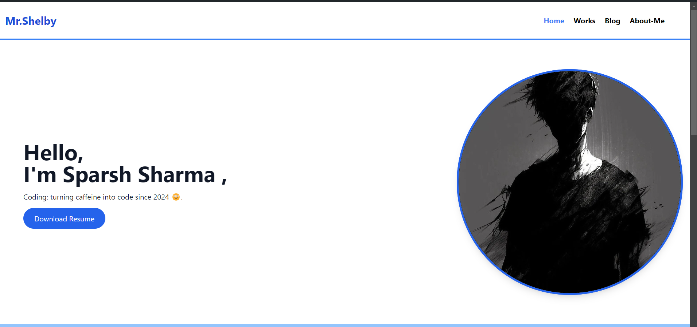
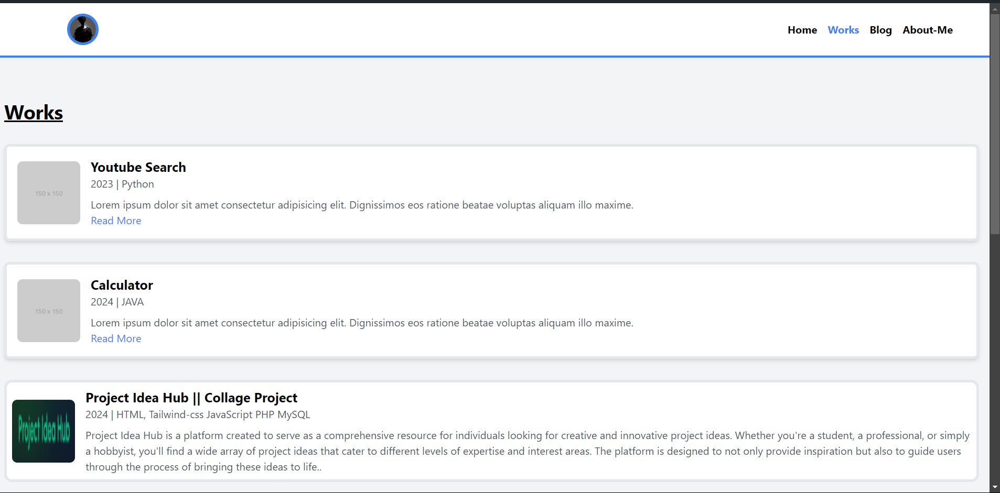
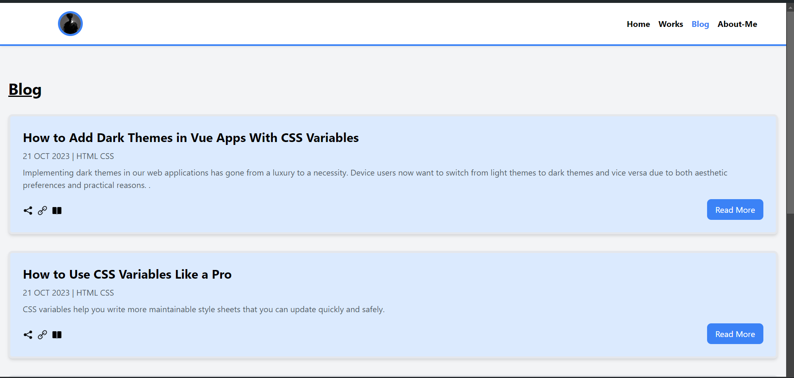
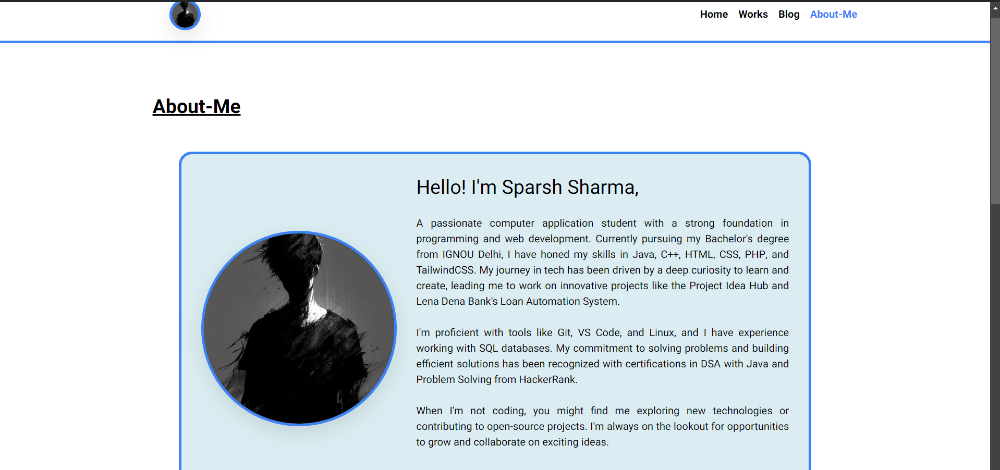

# My Portfolio

Welcome to my personal portfolio repository! This project showcases my work, skills, and experiences as a Computer Applications student and aspiring software developer. Below, you'll find a brief overview of the sections included in the portfolio, references to images, and instructions on how to run the project locally.

## Table of Contents

- [About Me](#about-me)
- [Skills](#skills)
- [Projects](#projects)
- [Images](#images)
- [Contact](#contact)
- [How to Run](#how-to-run)

## About Me

I am Sparsh Sharma, a Computer Applications student with over 2 years of experience in blog writing and web development. I have a strong foundation in HTML, CSS, Tailwind CSS, Python, Java, PHP, and Microsoft Office. My goal is to become a proficient software developer and contribute to impactful projects.

## Skills

- **Languages:** HTML, CSS, Tailwind CSS, Python, Java, PHP
- **Tools:** Microsoft Office, Git, GitHub
- **Frameworks & Libraries:** Tailwind CSS
- **Other:** Blog Writing, Content Creation

## Projects

### [Project Idea Hub](https://github.com/Mrshelby0/Project-Idea-Hub)
A platform designed to inspire creativity and innovation by providing a wide range of project ideas across various fields.

### [Brick Breaker Game](https://github.com/Mrshelby0/Brick-Breaker-Game) *(In Progress)*
An implementation of the classic Brick Breaker game as a fun project and a potential first-year minor project.

## Images

Here are some of the images that are included in this repository:

- **Profile Picture**:  
  

- **Project Showcase**:  
  

- **Work Environment**:  
  
  
-**About Me**:
  

These images are used to visually represent my work and projects in the portfolio.

## Contact

Feel free to reach out if you have any questions, suggestions, or collaboration opportunities!

- **Email:** [sparshsharma1409@gmail.com](mailto:sparshsharma1409@gmail.com)
- **GitHub:** [Mrshelby0](https://github.com/Mrshelby0)

## How to Run

To run this portfolio locally on your machine:

1. Clone the repository:
   ```bash
   git clone https://github.com/Mrshelby0/My_Portfolio.git
